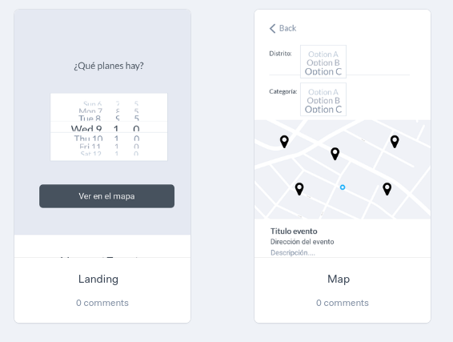

# MadEvents

## Objetivos del proyecto

Muchas veces hay eventos interesantes cerca de casa y por algún motivo no te enteras con antelación y luego hablando con amigos te comentan que fue muy interesante.

Voy a crear una aplicación web para poder consultar los eventos en Madrid y poder filtrarlos por distritos y/o categorías de forma que sea fácil descubrir nuevos eventos a los que asistir.

## Objetivos personales

- Aprender Boostrap
- Afianzar conocimientos de transiciones y animaciones
- Mejorar conocimientos de JavaScript
- Crear una aplicación en React y ampliar conocimientos (ej: hooks en componentes funcionales)
- Planificar y desarrollar un proyecto personal

## Descripción

Acceder a los datos de los eventos de los próximos 100 días en Madrid, a través de una API que proporciona el ayuntamiento. Guardar los datos y filtrarlos en base a las necesidades del usuario, se podrá filtrar por distrito y por categoría.

Además te permitirá ver todos los eventos en un mapa e interactuar pinchando en cada uno de ellos para obtener más información sobre el evento de interés. También incorporará la funcionalidad de añadirlo a Google Calendar para recibir la notificación y así recordarlo.

### Requisitos técnicos:

- Mostrar eventos en un mapa usando [Google Maps](https://developers.google.com/maps/documentation/javascript/tutorial?hl=es)
- Creación de una aplicación Web responsive usando React
- Uso de la [API de Google Calendar](https://developers.google.com/calendar/overview) para añadir el evento al calendario del usuario
- Uso de la API proporcionada por el Ayuntamiento de Madrid [`Actividades Culturales y de Ocio Municipal en los próximos 100 días`](https://datos.madrid.es/nuevoMadrid/swagger-ui-master-2.2.10/dist/index.html?url=/egobfiles/api.datos.madrid.es.json#!/Actividades32Culturales32y32de32Ocio32Municipal32en32los32pr243ximos3210032d237as/agenda_eventos_culturales_100_json) para obtener los eventos en los próximos 100 días
- Maquetación haciendo uso de Boostrap 4

### Prototipo

[Ver en Marvel](https://marvelapp.com/project/4619306/)

[Paleta de colores](https://colorhunt.co/palette/160292)

## Fases del proyecto

### Fase 1

Inicio del proyecto y obtención de los datos

- Crear estructura básica del proyecto en React
- Al iniciar la App, acceder a través de la API al servidor para obtener los datos de los eventos
  - Guardar eventos en local para futuro filtrado
  - Guardar posibles distritos y categorías por los que el usuario podrá filtrar
- Maquetar en mobile y desktop

### Fase 2

Tratamiento y visualización de los datos

- Filtrar los eventos guardados en local según la fecha seleccionada por el usuario
- Habilitar un boton para que te lleve al mapa y muestre el resultado del filtrado previo
- Añadir un botón para volver a la página inicial

### Fase 3

Filtrado y detalle de eventos

- Permitir al usuario filtrar por distrito
  - Mostrar un listado para seleccionar el distrito
  - Aplicar el filtrado en el Mapa
- Permitir al usuario filtrar por categoría
  - Mostrar un listado para seleccionar la categoría
  - Aplicar el filtrado en el Mapa
- Habilitar click en el mapa para mostrar más información del evento seleccionado (titulo, descripción, dirección, url,..)
- Maquetar en mobile y desktop

### Fase 4

Integración Google Calendar

- Permitir al usuario añadir el evento a su calendario personal

### BONUS

- Permitir compartir el evento por redes y mensajería
- Crear un chatbot para recomendar planes

## Feedback y valoración

Para saber si he conseguido el objetivo voy a:

✔️ Mostrar eventos en base a una fecha determinada

✔️ Filtrar eventos en un distrito y categorías específicas

✔️ Añadir un evento a mi calendario personal

✔️ Enseñar la web a diferentes usuarios para que la prueben
